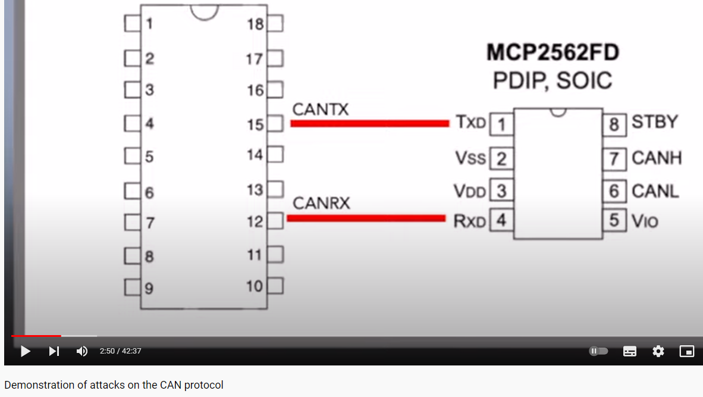
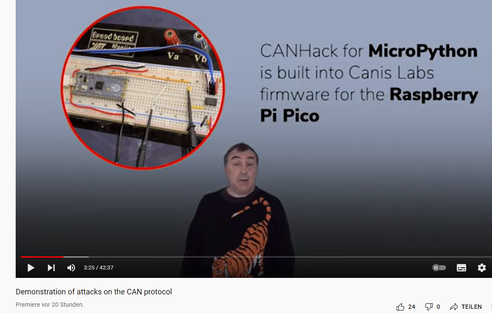
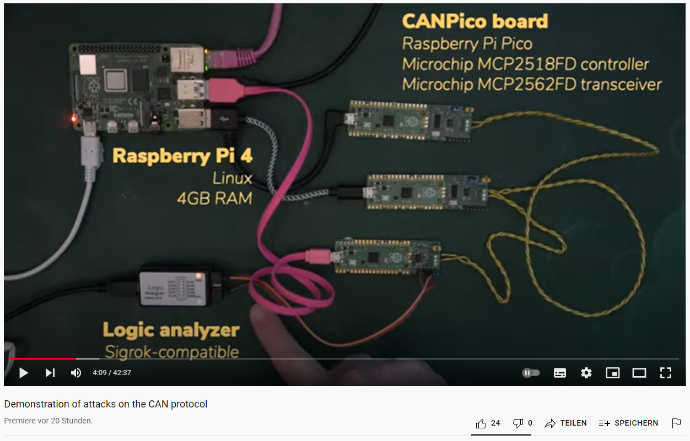
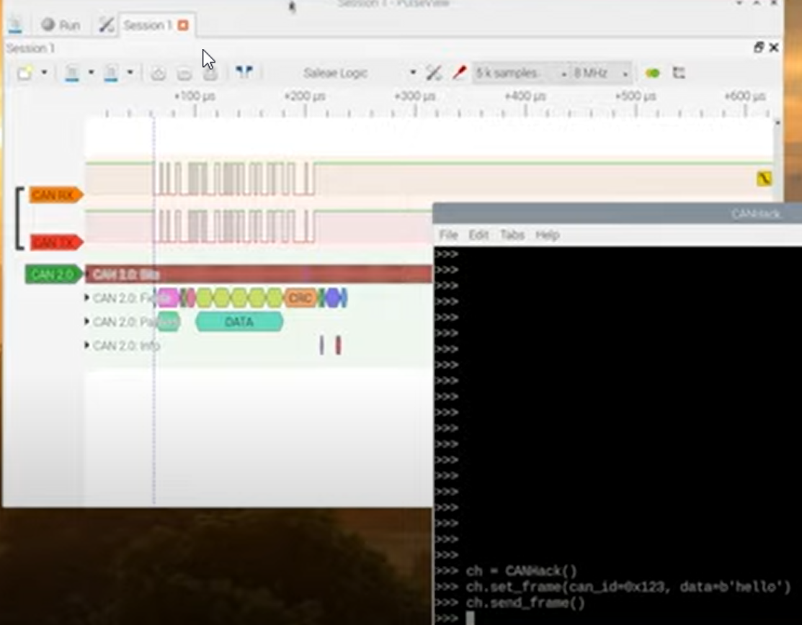
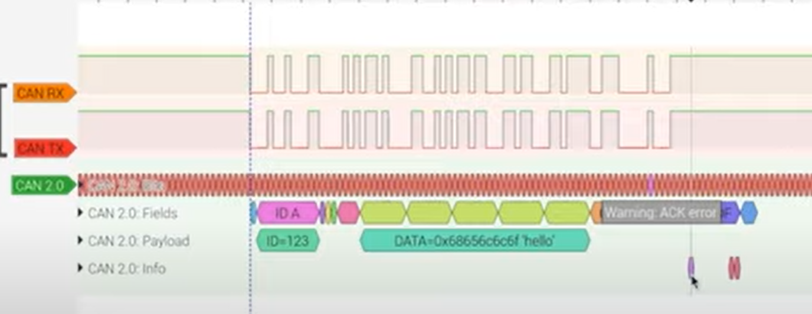

# ASRG WWW 20210923 Tindell Demonstration of attacks on the CAN protocol

* [https://www.youtube.com/watch?v=JZT5dJ9BkP0](https://www.youtube.com/watch?v=JZT5dJ9BkP0)

Join us for our upcoming ASRG-WORLD LiveStream, the global online \(COVID19 Approved\) version of ASRG. This time we have the pleasure of hosting Dr. Ken Tindell \(CTO of Canis Labs\). During his presentation we will learn about concepts of attacks on the CAN protocol and see some practical examples by using open source equipment \(like CANPico, CANHack, Sigrok CAN Logic Analyzer\) and we will also discuss how to mitigate the risk of success for such attacks.

PRESENTATION: “Demonstration of attacks on the CAN protocol”

In this presentation we describe the concept of attacks on the CAN protocol itself and then demonstrate several different attacks on a small benchtop CAN network of open source CANPico boards from Canis Labs, using the open source CANHack toolkit to mount the attacks and the Canis Labs open source Sigrok CAN logic analyzer to see how these attacks look. We will also discuss ways to mitigate these attacks.

ABOUT THE PRESENTER\(s\):

Dr. Ken Tindell : Dr. Tindell obtained his doctorate in real-time systems from the University of York and has spent many years in the automotive industry, focused on tools and technology for in-vehicle real-time embedded systems. He formulated timing analysis for CAN bus to guarantee frame latencies and invented the three buffer system for CAN controllers to avoid priority inversion. He has co-founded several automotive startups, including LiveDevices \(later acquired by Bosch\) and Volcano Communications Technologies \(later acquired by Mentor Graphics\).

### More from CANPico

* [https://kentindell.github.io/canpico](https://kentindell.github.io/canpico)
* [https://kentindell.github.io/2021/07/17/canpico-wireshark/](https://kentindell.github.io/2021/07/17/canpico-wireshark/)
* [https://kentindell.github.io/can2](https://kentindell.github.io/can2)
* [https://kentindell.github.io/2021/05/24/canpico-intro/](https://kentindell.github.io/2021/05/24/canpico-intro/)
* [https://kentindell.github.io/2020/01/20/canhack-toolkit/](https://kentindell.github.io/2020/01/20/canhack-toolkit/) 
* [https://www.cnx-software.com/2021/05/26/canpico-open-source-board-adds-can-bus-to-raspberry-pi-pico/](https://www.cnx-software.com/2021/05/26/canpico-open-source-board-adds-can-bus-to-raspberry-pi-pico/)
* [https://copperhilltech.com/canpico-can-fd-module-with-raspberry-pi-pico/](https://copperhilltech.com/canpico-can-fd-module-with-raspberry-pi-pico/)
* [http](https://buyzero.de/products/canpico-board)[://buyzero.de/products/canpico-board](https://buyzero.de/products/canpico-board)
* 
