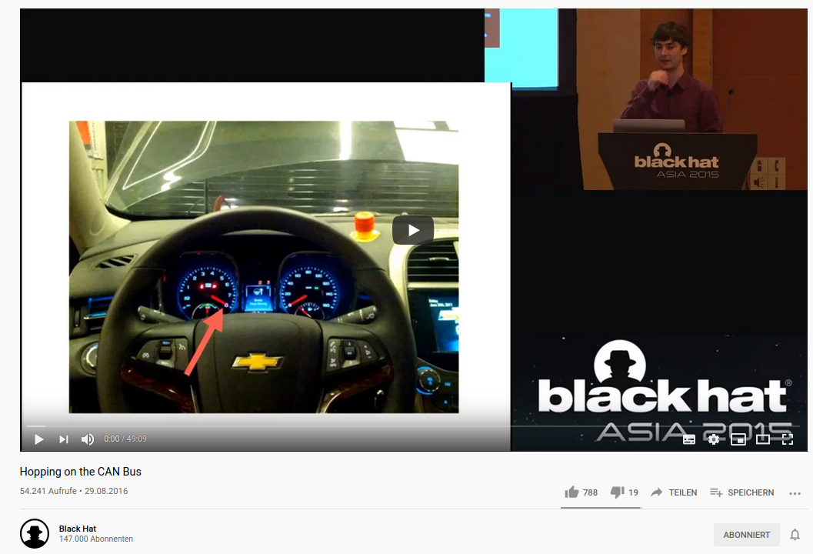

# CAN

## Sources

* [https://de.wikipedia.org/wiki/Controller\_Area\_Network](https://de.wikipedia.org/wiki/Controller\_Area\_Network)
* [https://en.wikipedia.org/wiki/CAN\_bus](https://en.wikipedia.org/wiki/CAN\_bus)
* [https://www.can-cia.org/can-knowledge/](https://www.can-cia.org/can-knowledge/)
* [https://www.hackers-arise.com/single-post/2017/08/04/Automobile-Hacking-Part-1-The-CAN-Protocol](https://www.hackers-arise.com/single-post/2017/08/04/Automobile-Hacking-Part-1-The-CAN-Protocol)
* [https://www.csselectronics.com/screen/page/simple-intro-to-can-bus](https://www.csselectronics.com/screen/page/simple-intro-to-can-bus)
* [https://makezine.com/2016/04/08/car-hacking-tools-trade/](https://makezine.com/2016/04/08/car-hacking-tools-trade/) Excerpt from the Car Hackers Handbook ([http://opengarages.org/handbook/](http://opengarages.org/handbook/))
* [https://github.com/mortedamos/vehicle-hacking/wiki](https://github.com/mortedamos/vehicle-hacking/wiki) from [ASRG-D](https://github.com/aueb/automotivesec/wiki/ASRG-Meetup-Detroit)
* [https://www.cowfishstudios.com/blog/canned-pi-part1](https://www.cowfishstudios.com/blog/canned-pi-part1)
* Work in Progress [https://canb.us/](https://canb.us)
  * [https://www.canb.us/tutorials/Quick Start](https://www.canb.us/tutorials/Quick%20Start)
* [http://obdtester.com/downloads](http://obdtester.com/downloads)

## Basics

* [https://makezine.com/2016/04/08/car-hacking-tools-trade/](https://makezine.com/2016/04/08/car-hacking-tools-trade/)
* [https://canb.us/tutorials/Tapping into a bus](https://canb.us/tutorials/Tapping%20into%20a%20bus)
* When CAN CANT - Tim Brom and Mitchell Johnson (GRIMM) [https://archive.org/details/youtube-oS-6xDc\_pP4](https://archive.org/details/youtube-oS-6xDc\_pP4)
* BlackHat Asia 2016 Hopping on the CAN Bus
  * [https://www.youtube.com/watch?v=U1yecKUmnFo](https://www.youtube.com/watch?v=U1yecKUmnFo)

by Eric Evenchick

Controller Area Network (CAN) is found in a number of systems, and is the main form of networking used in the automotive industry. Every new car has multiple CAN buses that let controllers communicate. This bus controls everything from the camshaft on your engine to your power seats.

In this talk, we will present and release CANard, an open-source toolkit which allows easy scripting of CAN bus tasks. This toolkit allows us to easily work with CAN, to talk to automotive controllers, perform diagnostic actions, and fuzz the protocols.

We will start with a brief introduction to CAN, look at the required hardware, and then start sending and receiving messages. We will explore CANard's features, and see several demos of real world vulnerabilities using our tool. We'll demonstrate how to read and clear fault codes, crack diagnostics security, and fuzz controllers to take over vehicle operation.

The talk will focus on practical applications. By the end of the talk, attendees will not only gain an understanding of automotive systems, but will also have the tools to attack them.

* [https://copperhilltech.com/raspberry-pi-3-system-with-can-bus-interface/](https://copperhilltech.com/raspberry-pi-3-system-with-can-bus-interface/)
* [https://www.cowfishstudios.com/blog/canned-pi-part1](https://www.cowfishstudios.com/blog/canned-pi-part1)

[https://www.cowfishstudios.com/uploads/2/8/6/1/28619761/326569.png?572](https://www.cowfishstudios.com/uploads/2/8/6/1/28619761/326569.png?572)

## Standards

* [https://pinoutguide.com/CarElectronics/car\_obd2\_pinout.shtml](https://pinoutguide.com/CarElectronics/car\_obd2\_pinout.shtml)
  * Skoda [https://pinoutguide.com/CarElectronics/skoda\_obd2\_diagnostic\_pinout.shtml](https://pinoutguide.com/CarElectronics/skoda\_obd2\_diagnostic\_pinout.shtml)

### ISO 11898

* ISO 11898-1:2015 Road vehicles — Controller area network — Part 1: Data link layer and physical signalling
* ISO 11898-2:2016 Road vehicles — Controller area network — Part 2: High-speed medium access unit
* ISO 11898-3:2006 Road vehicles — Controller area network — Part 3: Low-speed, fault-tolerant, medium dependent interface
* ISO 11898-4:2004 Road vehicles — Controller area network — Part 4: Time-triggered communication
* ISO 11898-5:2007 Road vehicles — Controller area network — Part 5: High-speed medium access unit with low-power mode
*   ISO 11898-6:2013 Road vehicles — Controller area network — Part 6: High-speed medium access unit with selective wake-up functionality

    **SAE J2284**
* SAE J2284-1:2016 High Speed CAN for Vehicle Applications at 125 kbps
* SAE J2284-2:2016 High Speed CAN for Vehicle Applications at 250 kbps
* SAE J2284-3:2016 High Speed CAN for Vehicle Applications at 500 kbps
* SAE J2284-4:2016 High Speed CAN for Vehicle Applications at 500 kbps with CAN FD Data at 2 Mbps
* SAE J2284-5:2016 High Speed CAN for Vehicle Applications at 500 kbps with CAN FD Data at 5 Mbps

### Higher Protocols

* 1992: CiA 201 series (CAN Application Layer)
* 1994: IEC 62026-3 (DeviceNet)
* 1994: SAE J1939 series
* 1994: EN 50325-4 (CANopen)
  * [https://www.can-cia.org/canopen/](https://www.can-cia.org/canopen/)
  * [https://www.can-cia.org/services/canopen-vendor-id/](https://www.can-cia.org/services/canopen-vendor-id/)
  * [https://www.csselectronics.com/screen/page/canopen-tutorial-simple-intro](https://www.csselectronics.com/screen/page/canopen-tutorial-simple-intro)
* 1999: ISO 11992 series
* 2000: IEC 61162-3 (NMEA 2000)
* 2002: ISO 11783 series (Isobus)
* 2004: ISO 15765 series (OBDII/ISO-TP)
* 2007: Arinc 825/826

#### Links

* [https://www.can-cia.org/can-knowledge/hlp/higher-layer-protocols/](https://www.can-cia.org/can-knowledge/hlp/higher-layer-protocols/)

### On-board diagnostics

* [https://en.wikipedia.org/wiki/On-board\_diagnostics](https://en.wikipedia.org/wiki/On-board\_diagnostics)

#### OBD2

#### Fault Codes

* [http://wiki.ross-tech.com/wiki/index.php/Category:Fault\_Codes](http://wiki.ross-tech.com/wiki/index.php/Category:Fault\_Codes)

#### Steering wheel angle

* [https://github.com/brendan-w/python-OBD/issues/40](https://github.com/brendan-w/python-OBD/issues/40)
* [http://wiki.ross-tech.com/wiki/index.php/VW\_Golf\_(1K)\_Steering\_Assist#Channel\_009:\_Steering\_Angle\_Sensor](http://wiki.ross-tech.com/wiki/index.php/VW\_Golf\_\(1K\)\_Steering\_Assist#Channel\_009:\_Steering\_Angle\_Sensor)
* [https://mechanics.stackexchange.com/questions/17634/read-steering-angle-data-in-real-time](https://mechanics.stackexchange.com/questions/17634/read-steering-angle-data-in-real-time)

## Chips

### ELM327

* [https://area515.org/elm327-hacking/](https://area515.org/elm327-hacking/)
* alternative Firmware [https://bitbucket.org/drbobbob/elm-lawicel/src/default/](https://bitbucket.org/drbobbob/elm-lawicel/src/default/)

## Testbed

### Pasta

* [https://github.com/pasta-auto](https://github.com/pasta-auto)
* [https://twitter.com/pasta\_auto](https://twitter.com/pasta\_auto)
* [https://www.blackhat.com/eu-18/briefings/schedule/index.html#pasta-portable-automotive-security-testbed-with-adaptability-13204](https://www.blackhat.com/eu-18/briefings/schedule/index.html#pasta-portable-automotive-security-testbed-with-adaptability-13204)

### value pasta auto

* [https://github.com/mintynet/value-pasta-auto](https://github.com/mintynet/value-pasta-auto)
* [https://www.linkedin.com/feed/update/urn%3Ali%3Aactivity%3A6751986348057485312/](https://www.linkedin.com/feed/update/urn%3Ali%3Aactivity%3A6751986348057485312/)
*

### RAMN Resistant Automotive Miniature Network

A safe platform to study and research automotive systems

\#rc3, #CAN, #automotivesec

to learn about automotive networks it is essential to find the right tools. here is one of them.

#### ### Links

* https://media.ccc.de/v/rc3-11443-ramn\_resistant\_automotive\_miniature\_network
* https://fahrplan.events.ccc.de/rc3/2020/Fahrplan/events/11443.html
* https://github.com/ToyotaInfoTech/RAMN
* [https://cyberweek.ae/2020/ramn-resistant-automotive-minimal-network/](https://cyberweek.ae/2020/ramn-resistant-automotive-minimal-network/)

### value-pasta-auto

* [https://github.com/mintynet/value-pasta-auto](https://github.com/mintynet/value-pasta-auto)
*

## # Cars

### Tesla

* **Tesla CAN bus data logging**
  * ****[**https://www.youtube.com/watch?v=54jQ7ut3FBA**](https://www.youtube.com/watch?v=54jQ7ut3FBA)****
  * ****[**http://store.evtv.me/proddetail.php?prod=TeslaCANKit**](http://store.evtv.me/proddetail.php?prod=TeslaCANKit)****

## Tools

* [canutils](canutils.md)
* [CANalyze](canalyze.md)
* [CANalyzat0r](canalyzat0r.md)
* [CANUSB](canusb.md)
* [Flashlogic FLXCAN](flashlogic\_flxcan.md)
* [USB2CAN](https://github.com/aueb/automotivesec/tree/d7d5885dbca30ae236e28c269a4a465e393ad706/tools/can/USB2CAN/README.md)
* [ValueCan4-1](https://github.com/aueb/automotivesec/tree/d7d5885dbca30ae236e28c269a4a465e393ad706/tools/can/ValueCan4-1/README.md)
* [VehicleSpy](https://github.com/aueb/automotivesec/tree/d7d5885dbca30ae236e28c269a4a465e393ad706/tools/can/VehicleSpy/README.md) by Intrepid
* [Easysync](https://github.com/aueb/automotivesec/tree/d7d5885dbca30ae236e28c269a4a465e393ad706/tools/can/Easysync/README.md)
* [Ikalogic SP209 Logic Analyzer](https://github.com/aueb/automotivesec/tree/d7d5885dbca30ae236e28c269a4a465e393ad706/tools/can/Ikalogic\_SP209\_Logic\_Analyzer/README.md)
* [CANtact](https://github.com/aueb/automotivesec/tree/d7d5885dbca30ae236e28c269a4a465e393ad706/tools/can/CANtact/README.md)
* canb.us and [Wireshark](https://github.com/aueb/automotivesec/tree/d7d5885dbca30ae236e28c269a4a465e393ad706/tools/can/Wireshark/README.md) [https://canb.us/tutorials/Wireshark](https://canb.us/tutorials/Wireshark)
* CANiBUS [https://github.com/Hive13/CANiBUS/](https://github.com/Hive13/CANiBUS/)
* [Scapy](https://github.com/aueb/automotivesec/tree/d7d5885dbca30ae236e28c269a4a465e393ad706/tools/can/Scapy/README.md)
* [GreatFET](https://github.com/aueb/automotivesec/tree/d7d5885dbca30ae236e28c269a4a465e393ad706/tools/can/GreatFET/README.md)
* [CANHack](canhack.md)

## Links

* [https://hackaday.com/2013/10/22/can-hacking-the-in-vehicle-network/](https://hackaday.com/2013/10/22/can-hacking-the-in-vehicle-network/)
* Cyber-attacks on vehicles
  * [http://dn5.ljuska.org/napadi-na-auto-sistem-1.html](http://dn5.ljuska.org/napadi-na-auto-sistem-1.html)
  * [http://dn5.ljuska.org/cyber-attacks-on-vehicles-2.html](http://dn5.ljuska.org/cyber-attacks-on-vehicles-2.html)
* [https://www.can-cia.org/](https://www.can-cia.org)
  * [https://www.can-cia.org/can-knowledge/](https://www.can-cia.org/can-knowledge/)
  * [https://www.can-cia.org/groups/specifications/](https://www.can-cia.org/groups/specifications/)
  * [https://www.can-cia.org/services/publications/further-information/information-brochures/](https://www.can-cia.org/services/publications/further-information/information-brochures/)
  * [https://www.can-cia.org/services/conferences/icc/](https://www.can-cia.org/services/conferences/icc/)
