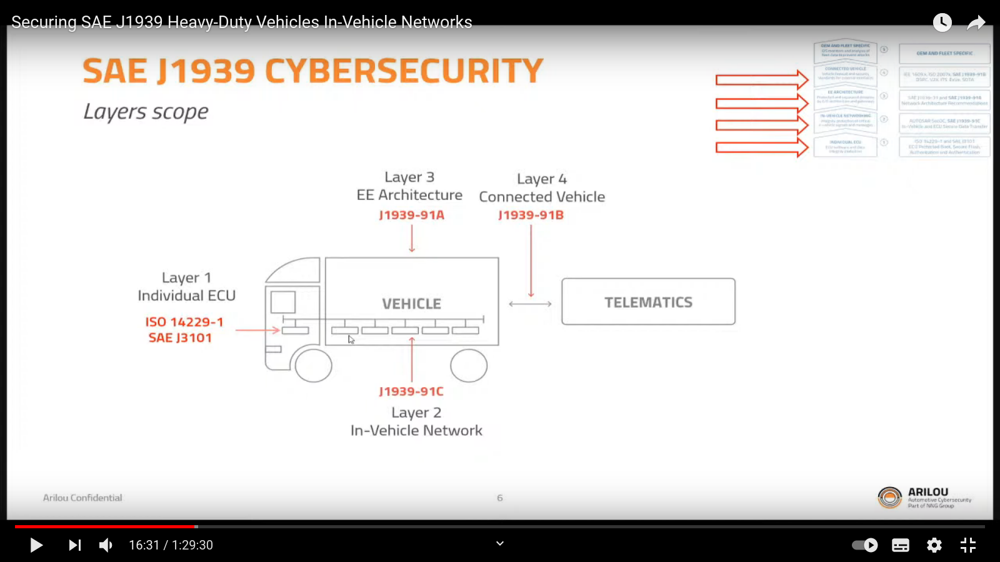
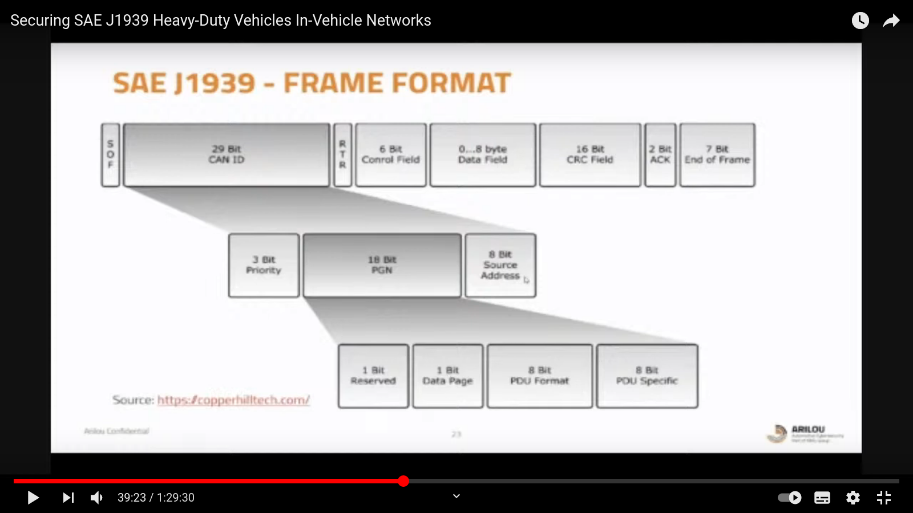
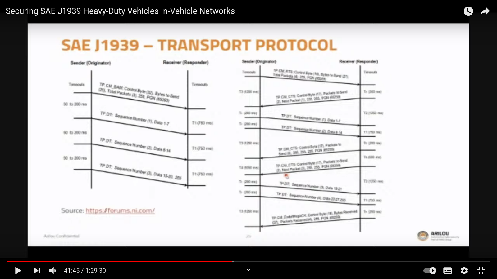

# SAE J1939

* SAE J1939**Securing SAE J1939 Heavy-Duty Vehicles In-Vehicle Networks**
  *  [https://www.youtube.com/watch?v=0R7G1qJi33o](https://www.youtube.com/watch?v=0R7G1qJi33o&t=2605s)
  * [https://ariloutech.com/news/heavy-duty-vehicles-sae-j1939-cybersecurity/](https://ariloutech.com/news/heavy-duty-vehicles-sae-j1939-cybersecurity/)
  * [https://www.sae.org/standards/content/j1939-91/](https://www.sae.org/standards/content/j1939-91/)
  * [https://www.sae.org/standardsdev/groundvehicle/j1939a.htm](https://www.sae.org/standardsdev/groundvehicle/j1939a.htm)
  * 

### 

### 

### Github Research

* [https://github.com/anthonysleck/arduino-can-bus](https://github.com/anthonysleck/arduino-can-bus)
* [https://github.com/isramos/arduino-can-bus-examples](https://github.com/isramos/arduino-can-bus-examples)
* [https://github.com/alperunlu/DTCparser](https://github.com/alperunlu/DTCparser)
* [https://github.com/SystemsCyber/ClaimDefender](https://github.com/SystemsCyber/ClaimDefender)
* [https://github.com/juergenH87/python-can-j1939](https://github.com/juergenH87/python-can-j1939)
* auf chinesisch [https://github.com/vvkill/SAE\_J1939](https://github.com/vvkill/SAE_J1939)
* [https://github.com/DarrenInwood/atm\_j1939\_command](https://github.com/DarrenInwood/atm_j1939_command)
  * [https://copperhilltech.com/sae-j1939-ecu-programming-vehicle-bus-simulation-with-arduino/](https://copperhilltech.com/sae-j1939-ecu-programming-vehicle-bus-simulation-with-arduino/)
  * [https://copperhilltech.com/ard1939-sae-j1939-protocol-stack-for-aduino/](https://copperhilltech.com/ard1939-sae-j1939-protocol-stack-for-aduino/)
* [https://github.com/cpperrr/sae-j1939](https://github.com/cpperrr/sae-j1939)
* [https://github.com/benkfra/j1939](https://github.com/benkfra/j1939)

